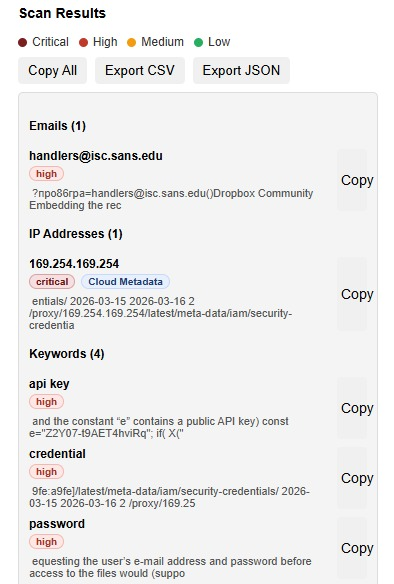

# Sensitive Info Scanner Chrome Extension

A Chrome extension for quick on-page discovery of potentially sensitive strings during defensive web investigations.

## Overview

The extension scans visible page text and highlights possible:
- Email addresses
- IPv4 addresses
- Sensitive keywords (for example password, secret, token, api key)
- Phone numbers

It is intended for triage and investigation support, not as a full DLP solution.

## Features

- One-click scan from popup
- Grouped findings with per-item copy button
- Count per finding category
- RAG risk labels per finding (critical, high, medium, low)
- Context snippets around each matched value for faster triage, with decoded URL-encoded text
- Improved keyword quality tiers and assignment-aware weighting for API key and credential indicators
- Special critical detection for cloud metadata endpoint `169.254.169.254`
- Copy all findings in one action
- Export findings to CSV and JSON
- Local processing in browser context

## Screenshot



## Project structure

```text
README.md
src/
├── manifest.json
├── popup.html
├── popup.js
└── images/
    ├── icon16.png
    ├── icon48.png
    └── icon128.png
```

## Installation

### Option 1: Chrome Web Store

Install directly from:
https://chromewebstore.google.com/detail/sensitive-info-scanner/ffamfmimbigjgkcklmminjpjaennplml?pli=1

### Option 2: Load unpacked

1. Open Chrome and go to `chrome://extensions/`
2. Enable **Developer mode**
3. Click **Load unpacked**
4. Select the `src` folder

### Option 3: Store package build

Package from inside `src` so `manifest.json` is at ZIP root:

```bash
cd src
zip -r ../sensitive-info-scanner-upload.zip .
```

## Permissions

- `activeTab`: inspect the currently active tab
- `scripting`: execute scanning logic in that tab

## Security and privacy notes

- Findings are generated locally from `document.body.innerText`.
- The extension does not intentionally send scan data to external services.
- Regex-based detection can generate false positives and false negatives.
- Run only on websites and data sources you are authorised to assess.

## Known limitations

- Regex matching is heuristic and context-free.
- International phone formats are only partially covered.
- Dynamic app pages that render late may require reopening popup to rescan.
- Chrome blocks script execution on some protected pages (for example browser-internal URLs).

## Roadmap ideas

- Add domain and URL extraction mode
- Add severity scoring by finding category and source context
- Add category filters in popup
- Add de-duplication normalisation for large pages

## Licence

MIT
